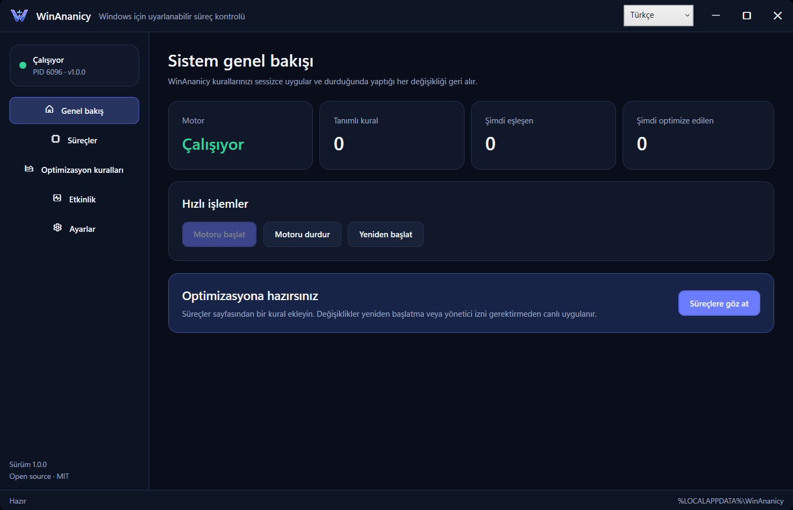

<p align="center">
  
</p>

<h1 align="center">WinAnanicy</h1>

<p align="center">
  Smart, reversible process optimization for Windows 10 and 11.<br>
  Windows 10 ve 11 için akıllı, geri alınabilir süreç optimizasyonu.
</p>

<p align="center">
  <a href="https://github.com/misutesu-desu/win-ananicy/releases/latest">Download setup</a> ·
  <a href="#english">English</a> ·
  <a href="#türkçe">Türkçe</a> ·
  <a href="CHANGELOG.md">Changelog</a>
</p>



## English

WinAnanicy is a lightweight Windows process optimizer with a native C++ engine
and a polished WPF control center. It applies rules only when needed, reports
what is actually active, and restores the original process state when a rule no
longer applies or the engine stops.

### Install

1. Download `WinAnanicy-1.0.0-Setup.exe` from
   [Releases](https://github.com/misutesu-desu/win-ananicy/releases/latest).
2. Choose English or Turkish in the installer.
3. Keep “Start the optimization engine automatically with Windows” enabled.
4. Open **Processes**, select an application, and choose **Add rule**.

The installer is per-user and does not require administrator access. A portable
ZIP is also published for advanced users.

### Highlights

- Live Dashboard, process browser, rule editor, activity log, and settings.
- Complete English and Turkish application and installer localization.
- One-click Game, Creative, Background, and Strict Saver profiles.
- CPU priority, I/O priority, core affinity, EcoQoS, and CPU-rate limits.
- Background-only rules based on the real foreground window.
- SmartTrim, sustained-load throttling, multi-instance balancing, blocking, and
  bounded Keep Alive recovery.
- Live config reload, strict validation, atomic saves, import/export, and ten
  rotating backups.
- Adaptive power plan that is enabled only while a qualifying rule is active.
- Notification-area controls and optional Windows startup.
- No service, no elevation, no telemetry, and no network connection.

### Safety model

The engine runs inside the signed-in user's interactive session. Configuration
is stored in `%LOCALAPPDATA%\WinAnanicy`, so an unprivileged configuration file
is never consumed by a `LocalSystem` service. WinAnanicy captures CPU priority,
I/O priority, affinity, EcoQoS, and rate-limit state before changing them and
restores those values on rule removal, foreground transitions, config reload,
and clean shutdown.

`Disallowed` terminates matching processes. `Keep Alive` starts the configured
executable if it is missing. Use both features only with applications you trust;
the editor prevents them from being enabled together.

### Affinity syntax

- `0,2,4` selects logical cores 0, 2, and 4.
- `10` selects logical core 10.
- `0x0F` uses an explicit hexadecimal mask.
- `mask:15` uses an explicit decimal mask.
- Empty means all available cores.

### Rule example

```json
[
  {
    "process_name": "example-game.exe",
    "cpu_priority": "High",
    "io_priority": "High",
    "cpu_affinity": null,
    "background_only": false,
    "eco_qos": false,
    "cpu_limit": 0
  }
]
```

| Field | Accepted value |
|---|---|
| `process_name` | Executable file name ending in `.exe`; paths are rejected |
| `cpu_priority` | `Idle`, `Below Normal`, `Normal`, `Above Normal`, `High` |
| `io_priority` | `Very Low`, `Low`, `Normal`, `High` |
| `cpu_affinity` | Core list, `0x` hexadecimal mask, `mask:` decimal mask, or `null` |
| `background_only` | Apply and restore the complete rule as focus changes |
| `eco_qos` | Windows efficiency mode |
| `cpu_limit` | `0` to disable or `1`–`99` percent |
| `smart_trim_threshold_mb` | `32`–`1048576`, or `null` |
| `cpu_throttle_trigger_pct` | `1`–`100`; requires duration |
| `cpu_throttle_duration_secs` | `1`–`3600`; requires trigger |
| `instance_balance` | Spread matching instances across logical cores |
| `disallowed` | Terminate matching processes |
| `keep_alive` | Restart the executable at `executable_path` with bounded backoff |

### Build from source

Requirements: Windows 10/11 x64, CMake 3.20+, a C++20 compiler, .NET 8 SDK,
and Inno Setup 6 for the installer.

```powershell
.\scripts\build-release.ps1
```

The command builds and tests the C++ engine, publishes the self-contained WPF
application, creates a portable ZIP and bilingual setup, and writes SHA-256
checksums to `artifacts`.

JSON-aware editors can use the bundled
[`rules.schema.json`](schemas/rules.schema.json) and
[`settings.schema.json`](schemas/settings.schema.json) definitions.

For a development-only build:

```powershell
cmake -S . -B build -DBUILD_TESTING=ON
cmake --build build --config Release
ctest --test-dir build -C Release --output-on-failure
dotnet build .\gui\WinAnanicyGui.csproj -c Release
```

## Türkçe

WinAnanicy; yerel C++ motoru ve modern WPF kontrol merkezi bulunan, hafif bir
Windows süreç iyileştiricisidir. Kuralları yalnızca gerektiğinde uygular, gerçekten
etkin olan değişiklikleri gösterir ve kural devreden çıktığında ya da motor
durduğunda sürecin özgün durumunu geri yükler.

### Kurulum

1. [Releases](https://github.com/misutesu-desu/win-ananicy/releases/latest)
   sayfasından `WinAnanicy-1.0.0-Setup.exe` dosyasını indirin.
2. Kurucuda Türkçe veya İngilizceyi seçin.
3. “Optimizasyon motorunu Windows ile otomatik başlat” seçeneğini açık bırakın.
4. **Süreçler** sayfasını açın, bir uygulama seçin ve **Kural ekle** düğmesine basın.

Kurulum kullanıcı bazlıdır ve yönetici izni gerektirmez. İleri düzey kullanıcılar
için taşınabilir ZIP paketi de yayımlanır.

### Öne çıkanlar

- Canlı Genel Bakış, süreç tarayıcısı, kural düzenleyici, etkinlik günlüğü ve ayarlar.
- Uygulama ve kurucuda eksiksiz Türkçe/İngilizce desteği.
- Tek tıkla Oyun, Üretim, Arka Plan ve Sıkı Tasarruf profilleri.
- CPU ve G/Ç önceliği, çekirdek seçimi, EcoQoS ve CPU oran sınırı.
- Gerçek ön plan penceresine göre çalışan arka plan kuralları.
- SmartTrim, sürekli yük sınırlaması, çoklu örnek dengeleme, engelleme ve
  sınırlı yeniden denemeli Canlı Tut.
- Canlı ayar yenileme, sıkı doğrulama, atomik kayıt, içe/dışa aktarma ve on yedek.
- Yalnızca uygun bir kural etkinken devreye giren uyarlanabilir güç planı.
- Bildirim alanı kontrolleri ve isteğe bağlı Windows ile başlangıç.
- Servis yok, yönetici izni yok, telemetri yok, ağ bağlantısı yok.

### Güvenlik modeli

Motor, oturum açmış kullanıcının etkileşimli masaüstünde çalışır. Ayarlar
`%LOCALAPPDATA%\WinAnanicy` altında tutulur; böylece kullanıcı tarafından
değiştirilebilen hiçbir dosya `LocalSystem` servisi tarafından çalıştırılmaz.
WinAnanicy CPU/G/Ç önceliğini, çekirdek seçimini, EcoQoS ve oran sınırını
değiştirmeden önce kaydeder; kural kaldırıldığında, odak değiştiğinde, ayarlar
yenilendiğinde ve motor düzgün kapandığında geri yükler.

`Engelle` eşleşen süreci kapatır. `Canlı Tut`, süreç bulunamazsa belirtilen
çalıştırılabilir dosyayı başlatır. Bu özellikleri yalnızca güvendiğiniz
uygulamalarda kullanın; arayüz ikisinin aynı anda açılmasını engeller.

### Çekirdek seçimi söz dizimi

- `0,2,4`, mantıksal 0, 2 ve 4 numaralı çekirdekleri seçer.
- `10`, mantıksal 10 numaralı çekirdeği seçer.
- `0x0F`, açık bir onaltılık maske kullanır.
- `mask:15`, açık bir ondalık maske kullanır.
- Boş değer tüm kullanılabilir çekirdekleri kullanır.

### Kaynaktan derleme

Gereksinimler: Windows 10/11 x64, CMake 3.20+, C++20 derleyicisi, .NET 8 SDK
ve kurucu için Inno Setup 6.

```powershell
.\scripts\build-release.ps1
```

Bu komut C++ motorunu derleyip test eder, bağımsız WPF uygulamasını yayımlar,
taşınabilir ZIP ile çift dilli kurulumu üretir ve `artifacts` klasörüne SHA-256
sağlamalarını yazar.

## Contributing

Issues and pull requests are welcome. Security reports should follow
[SECURITY.md](SECURITY.md). Every change must keep both English and Turkish
resources complete and pass the Windows build workflow.

## License

Copyright © 2026 Abdullah Çafer (misutesu-desu).

WinAnanicy is licensed under the
[GNU General Public License v3.0 or later](LICENSE).
